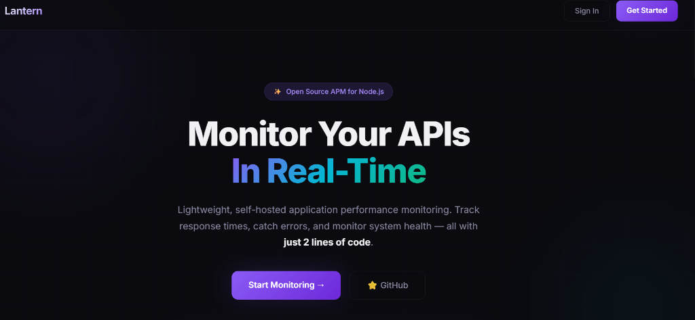
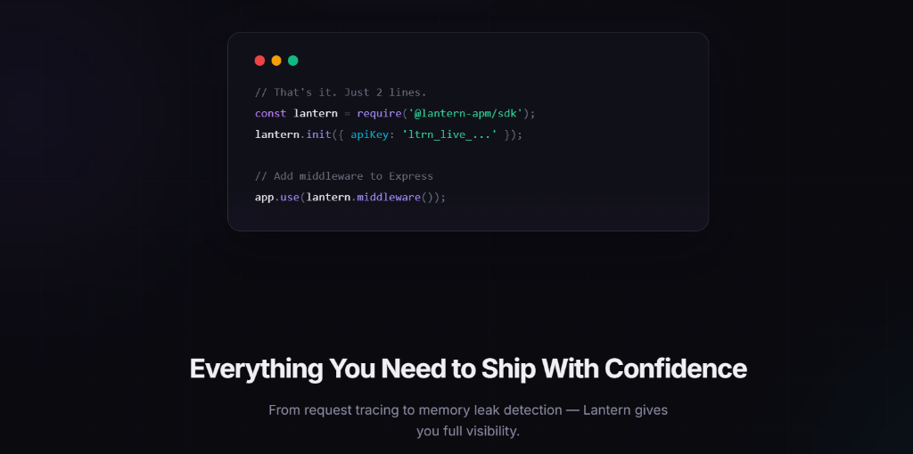
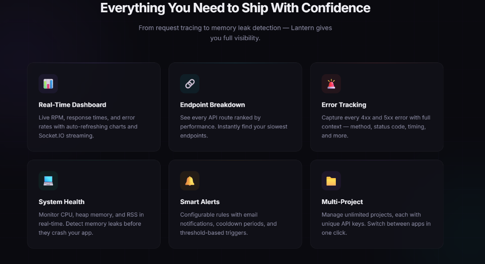

<p align="center">
  
</p>

<h1 align="center">🏮 Lantern APM</h1>

<p align="center">
  <strong>Lightweight, self-hosted Application Performance Monitoring for Node.js</strong>
</p>

<p align="center">
  
  
  
  
</p>

---

> **⚠️ Active Development — Not Production-Ready Yet**
>
> Lantern APM is currently in active development. Core features like real-time metrics ingestion, the dashboard UI, alerting, and the SDK are being built and iterated on. Some features may be incomplete, have rough edges, or change significantly.
>
> **What's working:** Landing page, auth system, project management, SDK metric collection, real-time dashboard with charts, error tracking, system health monitoring, alert configuration.
>
> **What's in progress:** Alert email delivery, historical data views, deployment guides, SDK publishing to npm.
>
> If you're a recruiter or visitor — thanks for checking this out! This project demonstrates full-stack architecture skills including real-time systems, time-series databases, message queues, and modern frontend design. Star ⭐ the repo to follow progress!

---

## 🎯 What is Lantern?

Monitor your APIs in real-time. Track response times, catch errors, and watch system health — with **just 2 lines of code**.

<p align="center">
  
</p>

---

## ✨ Features

<p align="center">
  
</p>

| Feature | Description |
|---|---|
| **📊 Real-Time Dashboard** | Live RPM, response times, and error rates with auto-refreshing charts and Socket.IO streaming |
| **🔗 Endpoint Breakdown** | Every API route ranked by performance — instantly find your slowest endpoints |
| **🚨 Error Tracking** | Capture every 4xx/5xx error with full context — method, status code, timing, and more |
| **💻 System Health** | CPU, heap memory, and RSS monitoring in real-time. Detect memory leaks before they crash your app |
| **🔔 Smart Alerts** | Configurable threshold rules with email notifications, cooldown periods, and threshold-based triggers |
| **📁 Multi-Project** | Manage unlimited projects, each with unique API keys. Switch between apps in one click |
| **🔐 JWT Authentication** | Secure user management with JWT-based auth |
| **⚡ Socket.IO Streaming** | Real-time metric updates pushed directly to the dashboard |

---

## 🏗 Architecture

```
┌──────────────┐     ┌──────────────────────────────────────────┐     ┌──────────────┐
│              │     │          Collector (Node.js)             │     │              │
│  Your App    │────▶│                                          │────▶│  Dashboard   │
│  + Lantern   │     │  Express API  │  Redis Queue  │ Workers  │     │  (Next.js)   │
│    SDK       │     │               │               │          │     │              │
└──────────────┘     └──────────┬────────────┬───────────────────┘     └──────────────┘
                               │            │
                        ┌──────▼──┐   ┌─────▼─────┐
                        │InfluxDB │   │  MongoDB   │
                        │(metrics)│   │(projects,  │
                        │         │   │ users,     │
                        └─────────┘   │ alerts)    │
                                      └───────────┘
```

**Data Flow:**
1. Your app uses the Lantern SDK → captures request metrics + system health
2. SDK flushes batches to the **Collector** (Express API)
3. Collector queues metrics via **Redis (BullMQ)** for non-blocking ingestion
4. Workers write time-series data to **InfluxDB** and metadata to **MongoDB**
5. **Dashboard** reads data and receives real-time updates via Socket.IO

---

## 🚀 Quick Start

### Prerequisites

- **Node.js** ≥ 18
- **Docker Desktop** (for InfluxDB, MongoDB, Redis)

### 1. Clone & Install

```bash
git clone https://github.com/KaranParmar19/Lantern.git
cd Lantern

# Install collector dependencies
cd collector && npm install

# Install dashboard dependencies
cd ../dashboard && npm install
```

### 2. Start Infrastructure

```bash
# From the root directory
docker-compose up -d
```

This starts:
- **InfluxDB** — Time-series metrics storage (port 8086)
- **MongoDB** — Projects, users, alerts (port 27017)
- **Redis** — Metrics queue (port 6379)

### 3. Start the Collector

```bash
cd collector
npm run dev
# ✅ Collector running on http://localhost:4000
```

### 4. Start the Dashboard

```bash
cd dashboard
npm run dev
# ✅ Dashboard running on http://localhost:3000
```

### 5. Register & Create a Project

1. Open `http://localhost:3000`
2. Click **"Get Started"** → Register an account
3. Go to **Projects** → Create a new project
4. Copy the generated **API key**

### 6. Instrument Your App

```bash
cd your-node-app
npm install /path/to/Lantern/sdk
```

Add to the top of your Express app:

```javascript
const lantern = require('@lantern-apm/sdk');
lantern.init({ projectKey: 'ltrn_live_your_key_here' });

const express = require('express');
const app = express();

app.use(lantern.middleware());

// ... your routes
```

### 7. Watch the Metrics Flow 🎉

Open `http://localhost:3000/dashboard` — you'll see live data within seconds.

---

## 📁 Project Structure

```
Lantern/
├── sdk/                    # Zero-dependency Node.js SDK
│   ├── src/index.js        # Core SDK (middleware, metrics, flush)
│   └── test/dummy-app.js   # Test Express app
├── collector/              # Backend service
│   ├── src/
│   │   ├── index.js        # Express server + Socket.IO
│   │   ├── routes/         # API routes (ingest, metrics, auth, projects, alerts)
│   │   ├── models/         # Mongoose models (Project, User, AlertRule, AlertHistory)
│   │   ├── services/       # Business logic (queue, alerts, auth)
│   │   ├── workers/        # Redis → InfluxDB metric processor
│   │   └── middleware/     # JWT auth middleware
│   └── .env                # Configuration (local dev defaults)
├── dashboard/              # Next.js 16 frontend
│   ├── src/
│   │   ├── app/            # Pages (overview, endpoints, errors, system, alerts, projects)
│   │   ├── components/     # Reusable UI components + landing page
│   │   ├── context/        # AuthContext provider
│   │   └── lib/            # API helpers, socket client
│   └── next.config.mjs
└── docker-compose.yml      # InfluxDB + MongoDB + Redis
```

---

## 🛠 Tech Stack

| Component | Technology |
|---|---|
| **SDK** | Pure Node.js (zero dependencies) |
| **Collector** | Express.js, Socket.IO, BullMQ (Redis) |
| **Dashboard** | Next.js 16, React 19, Recharts, Tailwind CSS |
| **Time-Series DB** | InfluxDB 2.7 |
| **Document DB** | MongoDB 7 + Mongoose |
| **Queue** | Redis 7 + BullMQ |
| **Auth** | JWT + bcrypt |
| **Real-time** | Socket.IO |

---

## ⚙️ Configuration

### Collector Environment Variables (`.env`)

| Variable | Default | Description |
|---|---|---|
| `PORT` | `4000` | Collector HTTP port |
| `MONGODB_URI` | `mongodb://localhost:27017/lantern` | MongoDB connection string |
| `INFLUX_URL` | `http://localhost:8086` | InfluxDB URL |
| `INFLUX_TOKEN` | `lantern-dev-token` | InfluxDB admin token |
| `INFLUX_ORG` | `lantern` | InfluxDB organization |
| `INFLUX_BUCKET` | `metrics` | InfluxDB bucket |
| `REDIS_HOST` | `localhost` | Redis host |
| `REDIS_PORT` | `6379` | Redis port |
| `JWT_SECRET` | (set in .env) | Secret for JWT signing |
| `JWT_EXPIRY` | `24h` | Token expiration time |

### SDK Init Options

```javascript
lantern.init({
  projectKey: 'ltrn_live_...',           // Required — from dashboard
  collectorURL: 'http://localhost:4000',  // Collector endpoint
  flushInterval: 10000,                   // Flush metrics every N ms
  systemMetricsInterval: 30000,           // System metrics collection interval
  debug: false,                           // Enable console logging
});
```

---

## 🗺 Roadmap

- [x] Zero-dependency SDK with auto-flush
- [x] Collector with BullMQ queue processing
- [x] InfluxDB time-series storage
- [x] JWT authentication & user management
- [x] Real-time dashboard with Socket.IO
- [x] Endpoint performance breakdown
- [x] Error tracking with full context
- [x] System health monitoring (CPU, memory)
- [x] Alert rule configuration
- [x] Multi-project support
- [x] Premium landing page
- [ ] Alert email delivery (SMTP integration)
- [ ] Historical data views & date range queries
- [ ] SDK publish to npm
- [ ] Deployment guides (Docker, Railway, Vercel)
- [ ] API documentation
- [ ] Rate limiting & API key rotation

---

## 📄 License

MIT — Use it, modify it, self-host it.

---

<p align="center">
  Built with ❤️ by <a href="https://github.com/KaranParmar19">Karan Parmar</a>
  <br/>
  <sub>⭐ Star this repo if you find it interesting!</sub>
</p>
